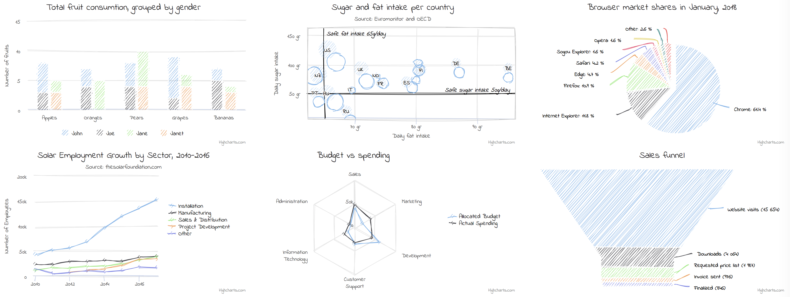

<p align="center">
  <a href="https://cdn.jsdelivr.net/gh/gangtao/sketchify/dist/sketchify.min.js">
    
  </a>
</p>

<p align="center">
  turns svg graph into sketchy
</p>

# Sketchify
Sketchify is a js tool that turns svg graph into sketchy visualization. It is based on [Rough.js](https://github.com/pshihn/rough)

### Build
```sh
npm install
npm run build
```

### Usage
To turn an existing graph that composed by svg into sketch mode.  Run following code:
```javascript
const option = {
    fillStyle: 'hachure',
    roughness: 1,
    bowing: 1,
    chartType: 'highcharts',
};
// container is the root dom element that contains related graph svg
const handler = Sketchifier(container, option);
handler.handify();

// call restore will turn the graph back to original one
handler.restore();
```
Refer to [roughjs api document](https://github.com/pshihn/rough/wiki) for options of `fillStyle`, `roughness` and `bowing`.

### demo



There are 5 demo charts types:
- [ECharts](https://echarts.apache.org/zh/index.html)
- [AntV G2](https://antv.alipay.com/zh-cn/g2/3.x/index.html)
- [highcharts](https://www.highcharts.com/)
- [amcharts](https://www.amcharts.com/)
- [xCharts](http://xgfe.github.io/xCharts/)

After `npm run build-dev`, open related html file in `demo` folder will show you the demo.

Or you can refer to following codepen pages:
- [ECharts](https://codepen.io/gangtao/full/ZEEVzpw)
- [AntV G2](https://codepen.io/gangtao/full/wvvRwzp)
- [highcharts](https://codepen.io/gangtao/full/eYYrpBX)
- [amcharts](https://codepen.io/gangtao/full/PooxBpV)
- [xCharts](https://codepen.io/gangtao/full/PooxBWV)


### new chart type support
Sketchify is high generalized, now I have tried to support most chart types in highcharts and xCharts, the customization is to filter some svg element that does not need to sketchify.  Adding a blacklist of related element class.  In case you want to do something similar, refer to [highcharts.js](./src/highcharts.js)
